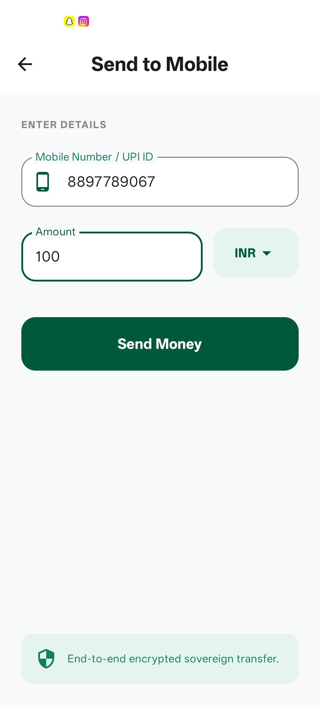
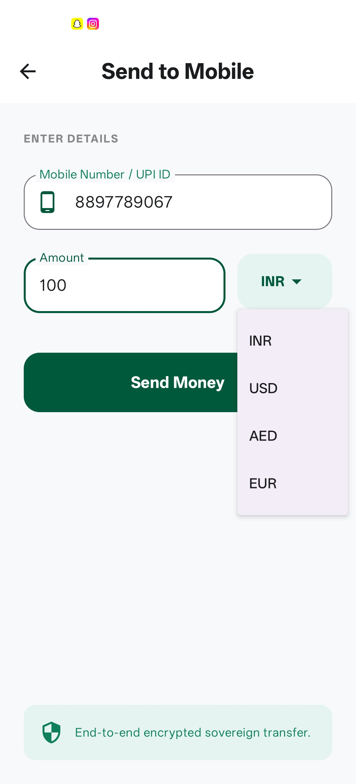
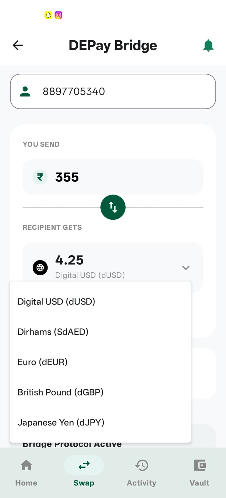
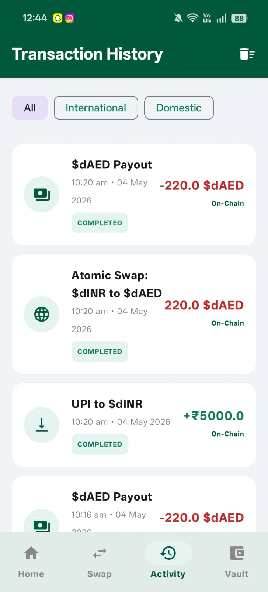
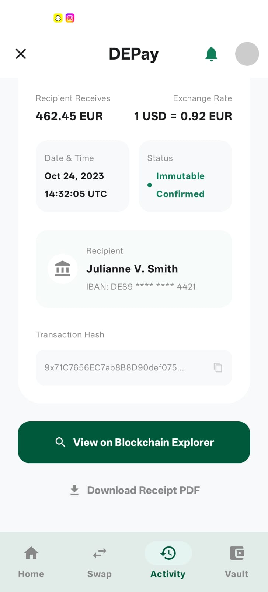

## 📱 Application Screenshots

### Send Money

Users can initiate cross-border transfers using a mobile number or UPI ID.

---

### Currency Selection

Select the destination currency for international settlement.

---

### Atomic Swap Engine

Convert local currency into digital sovereign assets through blockchain-powered atomic swaps.

---

### Transaction History

Track tokenization, atomic swaps, and payout transactions with complete transparency.

---

### Blockchain Receipt

View immutable transaction records, exchange rates, recipient information, and transaction hashes.

